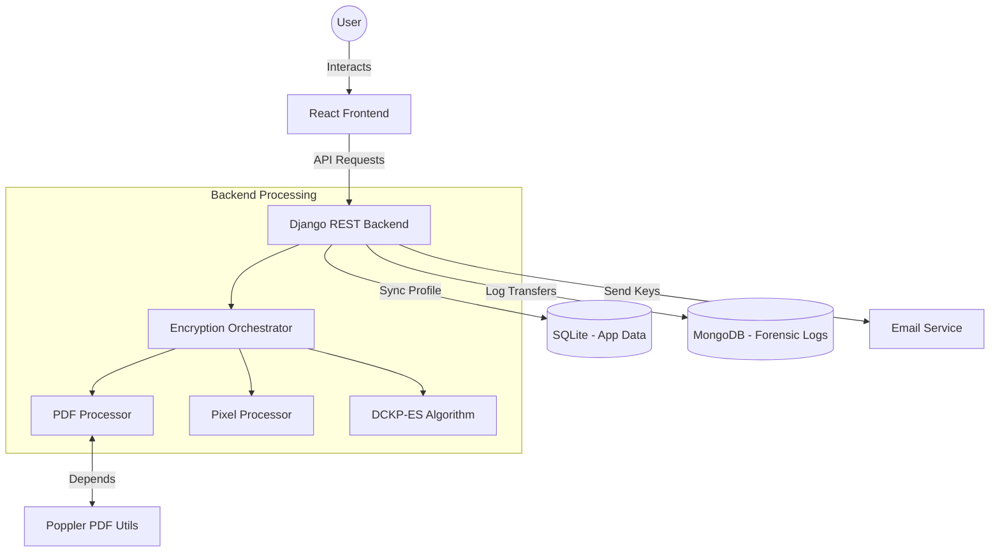

# Aartha AI: Comprehensive Project Documentation
## Secure PDF Encryption using DCKP-ES Algorithm

---

## 1. Project Overview

**Aartha AI** is a sophisticated full-stack web application designed for the secure encryption and sharing of PDF documents. It addresses the growing need for privacy in digital document exchange by employing a custom-built cryptographic approach called **DCKP-ES (Dynamic Chaos Key Pixel Encryption Shuffling)**.

### Core Mission
To provide a platform where users can securely "scramble" PDF documents into a visually unrecognizable format (encrypted image chunks) and share them with others, ensuring that only the intended recipient with the correct dynamic key can reconstruct the original document.

### Key Features
- **Zero-Storage of Decrypted Data**: The system does not store decrypted PDFs. Processing happens in memory or temporary buffers.
- **Dynamic Chaos Encryption**: pixel-level encryption powered by logistic maps and chaotic sequences.
- **Visual Forensic Obfuscation**: Encrypted files can be wrapped in valid PNG containers, appearing as random image noise or standard images in file galleries.
- **Email-Based Workflow**: Direct integration with email services for sending encrypted packages and keys.
- **Account-Free Decryption**: Recipients do not need an account to decrypt; they only need the `.enc` file and the generated key.

---

## 2. System Architecture

The project follows a modern decoupled architecture with a React frontend and a Django backend.

### High-Level Architecture


### Components
- **Frontend (React + Vite)**: A premium, dark-themed SPA (Single Page Application) that manages user sessions, file uploads, and provides an intuitive dashboard for encryption/decryption.
- **Backend (Django)**: Handles authentication, API routing, and orchestrates the complex encryption/decryption pipelines.
- **Databases**:
    - **SQLite**: Stores user accounts, profile information, and Django administrative data.
    - **MongoDB**: Used for high-speed, flexible logging of file transfers (Sender, Receiver, Timestamp, File Metadata).
- **Poppler**: A critical external dependency used for high-fidelity conversion between PDF pages and image representations.

---

## 3. Core Algorithms and Logic

### 3.1 PDF Processing Flow
The system treats a PDF not as a collection of text/vectors, but as a series of visual surfaces.

1.  **PDF to Image**: Using `pdf2image` (backed by Poppler), each page of the uploaded PDF is rendered into a high-quality RGB image array.
2.  **Image to PDF**: During decryption, the reconstructed image arrays are merged back into a single PDF document using `img2pdf`.

### 3.2 DCKP-ES (Dynamic Chaos Key Pixel Encryption Shuffling)
This is the heart of the system. It combines chaotic mathematics with traditional pixel manipulation.

#### A. Key Derivation
The encryption key is **dynamic** and **deterministic**. It is generated from:
- `Filename`: The name of the original file.
- `Timestamp`: The exact microsecond the encryption started.

A SHA-256 hash of `filename | timestamp` is computed.
- The first 16 bytes are used as an **AES-128 key** (for secondary metadata security).
- The remaining bytes are processed to derive a **Chaos Seed** (a float between 0.1 and 0.9).

#### B. The Logistic Map
The system uses the **Logistic Map** equation for chaos generation:
$$x_{n+1} = r \cdot x_n \cdot (1 - x_n)$$
Where $r = 3.99$ (ensuring a high state of chaos).

This sequence is highly sensitive to the initial seed. Even a difference of $10^{-10}$ in the seed results in a completely different chaotic sequence, making the encryption robust.

#### C. Pixel Shuffling and Encryption
1.  **Chunking**: The image is divided into small 32-pixel chunks.
2.  **Shuffling**: A chaos-based sequence determines the new position of these chunks, effectively "scrambling" the image structure.
3.  **XOR Diffusion**: Every pixel value in the scrambled image is XORed with a value from the chaotic sequence.
4.  **Forward Diffusion**: To ensure that a change in one pixel affects all subsequent pixels, a diffusion pass is applied: `pixel[i] = pixel[i] XOR pixel[i-1]`.

---

## 4. Workflow Details

### 4.1 The Encryption Journey
1.  **Upload**: User selects a PDF and enters the recipient's email.
2.  **Conversion**: Backend converts PDF pages to RGB numpy arrays.
3.  **Key Gen**: System generates a unique timestamp and derives the DCKP-ES key.
4.  **Processing**: Each page is chunked, shuffled, XORed, and diffused.
5.  **Packaging**: The encrypted pixels and minimal metadata are bundled into a custom `.enc` file format.
    - *Optional*: The `.enc` data can be appended to a valid PNG header so it looks like a normal image.
6.  **Persistence**: A record is written to MongoDB (Sender, Receiver, File Hash).
7.  **Dispatch**: The `.enc` file and the decryption key (`filename|timestamp`) are sent via email.

### 4.2 The Decryption Journey
1.  **Input**: Recipient uploads the `.enc` file and enters the provided key.
2.  **Validation**: System parses the `.enc` header to find the "AARTHA" magic bytes and metadata.
3.  **Re-Generation**: Using the provided key, the system re-calculates the exact same chaotic sequence and shuffle indices.
4.  **Reversal**:
    - Reverse Forward Diffusion.
    - Reverse XOR Encryption.
    - Un-shuffle pixel chunks.
5.  **Assembly**: Images are converted back to PDF.
6.  **Delivery**: The user is prompted to download the decrypted PDF.

---

## 5. Technical Stack and Dependencies

### Backend
- **Framework**: Django 4.2+
- **API**: Django REST Framework (DRF)
- **Image Processing**: 
    - `Pillow`: Image manipulation and formatting.
    - `numpy`: Fast vectorized pixel operations for encryption.
- **Cryptography**: 
    - `pycryptodome`: Used for secure AES key derivation and metadata encryption.
- **PDF Manipulation**:
    - `PyPDF2`: PDF metadata and structure handling.
    - `pdf2image`: Converting PDF pages to PIL images.
    - `img2pdf`: High-fidelity conversion of images back to PDF.

### Frontend
- **Framework**: React 18
- **Build Tool**: Vite
- **Styling**: Vanilla CSS (Premium Dark Theme)
- **Icons**: Lucide React

### External Services
- **MongoDB**: Used for persistent, searchable transfer logs.
- **Poppler**: Required command-line utility for `pdf2image`.
- **Gmail SMTP**: Default service for sending encrypted files.

---

## 6. Installation and Setup Guide

### 6.1 Prerequisites
- **Python 3.10+**
- **Node.js 18+**
- **MongoDB** (Local or Atlas)
- **Poppler** (Must be in System PATH)

### 6.2 Backend Setup
1.  **Extract/Clone** the repository.
2.  **Create Virtual Environment**:
    ```bash
    python -m venv venv
    venv\Scripts\activate  # Windows
    source venv/bin/activate # Linux/Mac
    ```
3.  **Install Dependencies**: `pip install -r requirements.txt`
4.  **Manage Settings**: Copy `.env.example` to `.env` and fill in:
    - `SECRET_KEY`, `MONGODB_URI`, `EMAIL_HOST_USER`, `EMAIL_HOST_PASSWORD`.
5.  **Initialize DB**: 
    ```bash
    python manage.py migrate
    python manage.py createsuperuser
    ```

### 6.3 Frontend Setup
1.  Navigate to `/frontend`.
2.  Install dependencies: `npm install`.
3.  Start dev server: `npm run dev`.

### 6.4 Run with Docker (Hub Images)
For users who prefer a containerized deployment using pre-built images from Docker Hub:

1.  **Download the Compose File**:
    Download only the `docker-compose.hub.yml` file:
    ```bash
    curl -O https://raw.githubusercontent.com/Dharanitharan03/aartha_AI/main/docker-compose.hub.yml
    ```
2.  **Run the Container**:
    ```bash
    docker-compose -f docker-compose.hub.yml up -d
    ```

#### Troubleshooting: "no configuration file provided: not found"
This error occurs when Docker Compose cannot locate the configuration file in your current working directory.
- **Ensure you are in the correct folder** where the `.yml` file is located.
- **Explicitly specify the file** using the `-f` flag: `docker-compose -f docker-compose.hub.yml up -d`.
- **Alternative**: Rename `docker-compose.hub.yml` to `docker-compose.yml` to use standard commands.

---

## 7. API Documentation

### 7.1 Authentication Endpoints
- **`POST /api/auth/register/`**: Create a new user account.
- **`POST /api/auth/login/`**: Retrieve an authentication token.
- **`POST /api/auth/logout/`**: Invalidate the current token.

### 7.2 Encryption Endpoints
- **`POST /api/encryption/encrypt/`**:
    - **Payload**: Form-data (`file`: PDF, `receiver_email`: String)
    - **Header**: `Authorization: Token <key>`
    - **Success (200)**: Returns encryption status and logs the transfer.
- **`POST /api/encryption/decrypt/`**:
    - **Payload**: Form-data (`file`: `.enc` file, `key`: `filename|timestamp`)
    - **Success (200)**: Returns the decrypted PDF file for download.
- **`GET /api/encryption/history/`**:
    - Returns a list of all transfers associated with the logged-in user (from MongoDB).

---

## 8. Project Directory Structure

```text
aartha_AI/
├── apps/
│   ├── accounts/          # User management and Auth logic
│   └── encryption/        # The Core "Brain"
│       ├── services/
│       │   ├── dckp_es.py            # The math behind the chaos
│       │   ├── pdf_processor.py      # PDF ↔ Image conversion
│       │   ├── pixel_processor.py    # Pixel chunking/shuffling logic
│       │   ├── mongodb_service.py    # Log management for MongoDB
│       │   └── encryption_orchestrator.py # Glues everything together
│       └── views.py       # API view logic
├── config/                # Django project settings
├── frontend/              # React source code (Vite project)
├── poppler/               # (Optional) Bundled poppler binaries
├── .env                   # Sensitive configuration
└── manage.py              # Django entry point
```

---

## 9. Troubleshooting and FAQs

**Q: Why do I get a Poppler error?**
A: Ensure Poppler is installed and specifically added to your system's `PATH`. On Windows, the `POPPLER_PATH` in `.env` should point to the `/bin` folder of your Poppler installation.

**Q: Why aren't emails being sent?**
A: If using Gmail, you MUST use an **App Password**, not your regular login password. Also, ensure `EMAIL_USE_TLS=True`.

**Q: Can I decrypt a file without an account?**
A: Yes. The decryption endpoint does not require authentication, allowing anyone with the correct key and file to access the content.

---
*Developed by DharaniTharanN as a Final Year Project Experiment in Advanced Image Forensics and Cryptography.*
